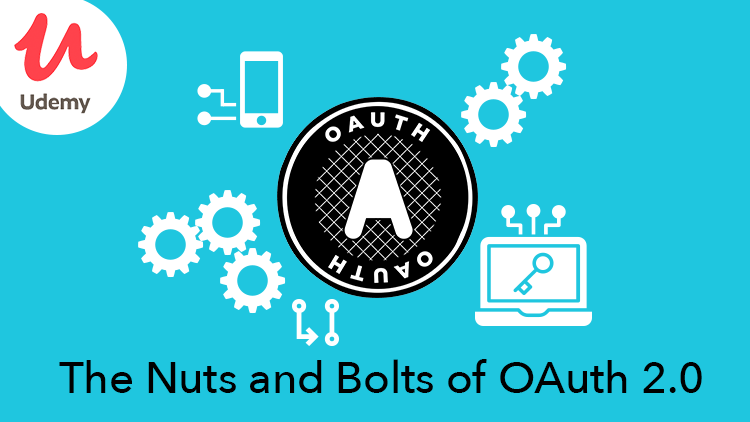

# OAuth 2.0

Este é um relatório desenvolvido como parte da disciplina de Programação Web, note que está documentação pode estar desatualizada no momento em que se esta lendo, consulte a [documentação oficial](https://oauth.net/2/).

OAuth 2.0 é o protocolo padrão do setor para autorização. OAuth 2.0 se concentra na simplicidade do desenvolvedor do cliente, ao mesmo tempo em que fornece fluxos de autorização específicos para aplicativos da Web, aplicativos de desktop, telefones celulares e dispositivos de sala de estar. Esta especificação e suas extensões estão sendo desenvolvidas no [Grupo de Trabalho OAuth da IETF](https://datatracker.ietf.org/wg/oauth/about/).

[OAuth 2.1]() é um esforço em andamento para consolidar o OAuth 2.0 e muitas extensões comuns sob um novo nome.

Video Course: The Nuts and Bolts of OAuth 2.0
